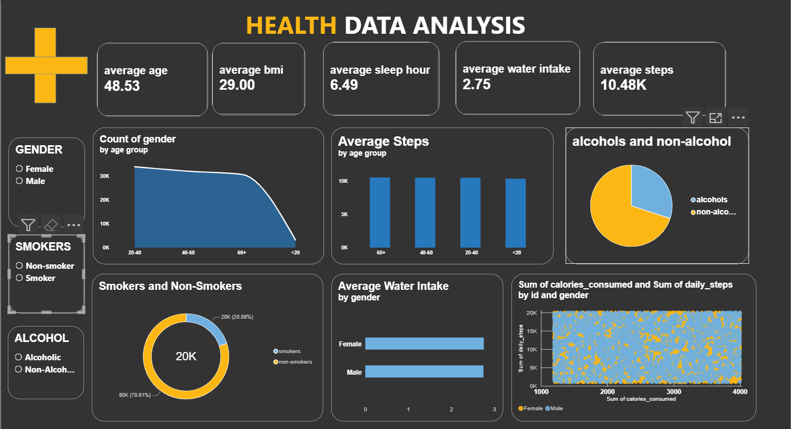

# Health Data Analysis | Power BI

Interactive Health Data Analysis Dashboard built using Microsoft Power BI to explore health and lifestyle data.

## Tools & Technologies

- Power BI
- DAX
- Power Query
- Microsoft Excel
- Data Cleaning
- Data Visualization

## Project Overview

This project focuses on analyzing health and lifestyle data through an interactive Power BI dashboard. The dashboard presents key metrics and visualizations related to age, BMI, sleep, water intake, daily steps, smoking, alcohol consumption, calories consumed, and gender.

## Key KPIs

- Average Age
- Average BMI
- Average Sleep Hours
- Average Water Intake
- Average Steps

## Analysis

The dashboard includes analysis of:

- Gender distribution
- Age-group analysis
- Average steps by age group
- Alcohol and non-alcohol consumption
- Smokers and non-smokers
- Average water intake by gender
- Calories consumed and daily steps
- Interactive filtering by gender, smoking status, alcohol consumption, and other available categories

## Dashboard Preview

## Project Files

- `Health Data Analysis.pbix` — Power BI dashboard file
- `DASHBOARD.png` — Dashboard preview
- `README.md` — Project documentation
